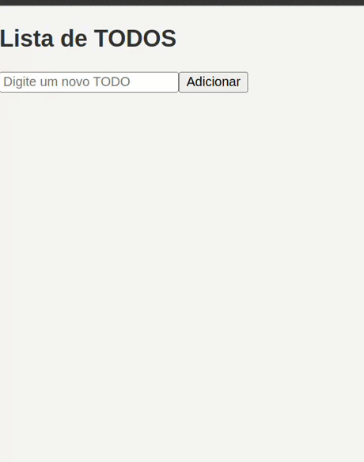
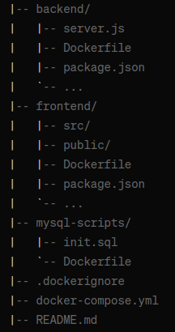

# Projeto de Lista de Tarefas (TODO) com Docker

Este projeto é uma aplicação de Lista de Tarefas (TODO) composta por três partes: frontend, backend e banco de dados. Todo o projeto é orquestrado usando Docker Compose.
Faz parte das etapas de aprendizado em Docker do curso Devª ADA | B3



## Requisitos

- Docker
- Docker Compose

## Instruções de Uso

1. Clone este repositório:

   ```bash
   git clone https://github.com/seu-usuario/seu-repositorio.git

Navegue até o diretório do projeto:
```
cd seu-repositorio
```
#### Detalhes da Configuração
O backend se comunica com o banco de dados MySQL usando as seguintes variáveis de ambiente:

MYSQL_HOST: Nome do serviço do banco de dados no Docker Compose.
MYSQL_USER: Usuário do banco de dados.
MYSQL_PASSWORD: Senha do banco de dados.
MYSQL_DATABASE: Nome do banco de dados.

Frontend
O frontend faz solicitações HTTP para o backend usando o nome do serviço no Docker Compose como host
```
Ajuste as Variáveis de ambiente conforme o arquivo .env.example

```

Execute o Docker Compose para construir e iniciar os serviços:

```
docker-compose up --build -d
```

Acesse a aplicação no seu navegador em
```
 http://localhost:3000
 ```

### Estrutura do Projeto



- frontend/: Código-fonte do frontend da aplicação React.
- backend/: Código-fonte do backend da aplicação Node.js.
- mysql-scripts/: Scripts SQL para inicializar o banco de dados MySQL.

### Problemas comuns

Caso não rode de primeira, verifique se todos os serviços estão subindo com a ordem correta: database, backend e frontend respectivamente.

```
docker compose down
```

```
docker compose up -d
```

### Para encerrar os serviços 
```
docker compose down
```
E para encerrar removendo os volumes:
```
docker compose down -v
```